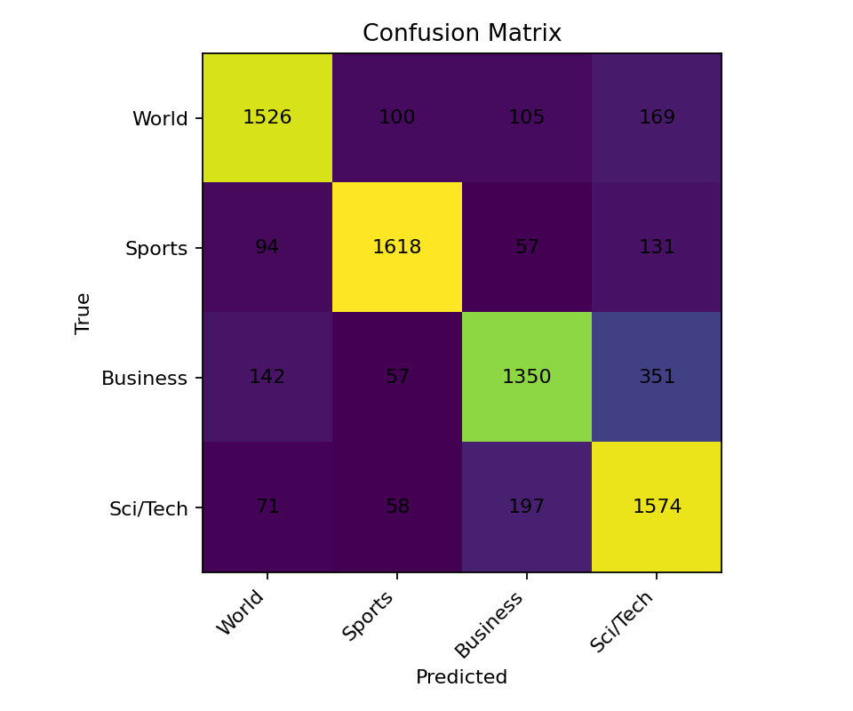
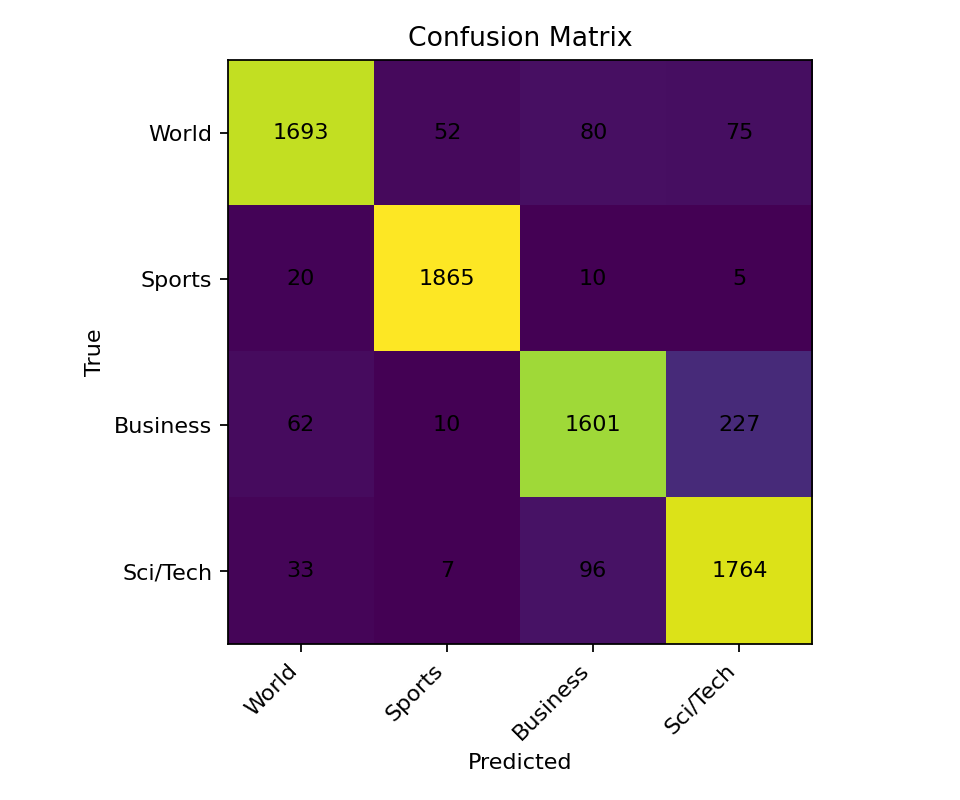
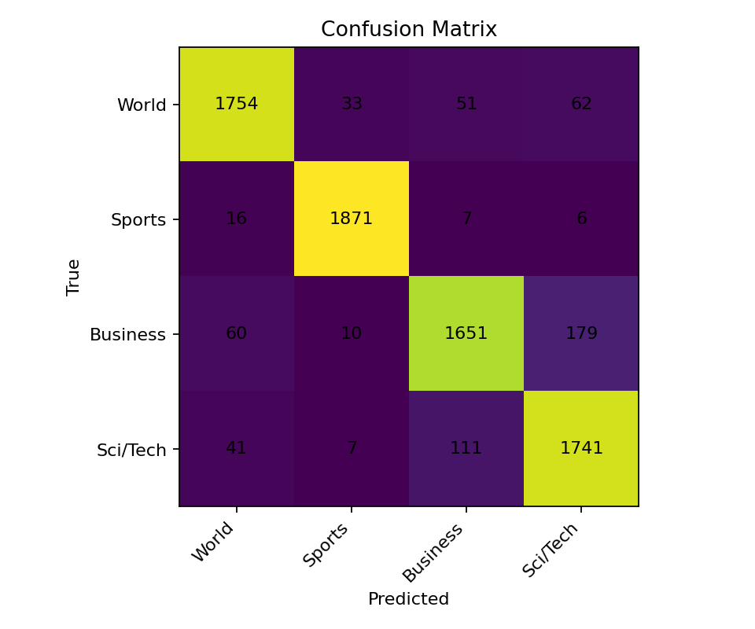
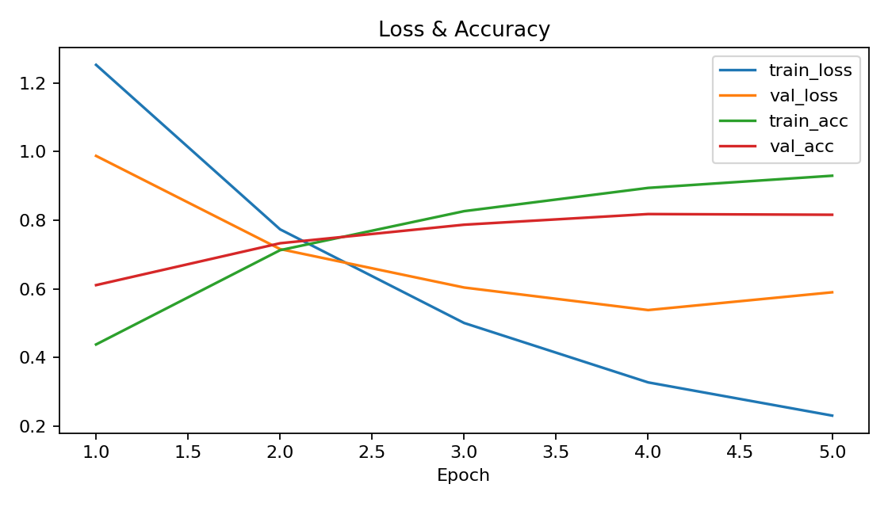
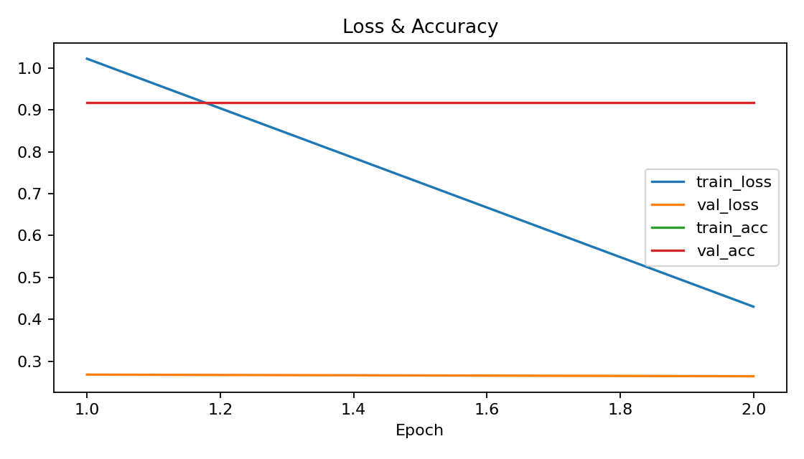
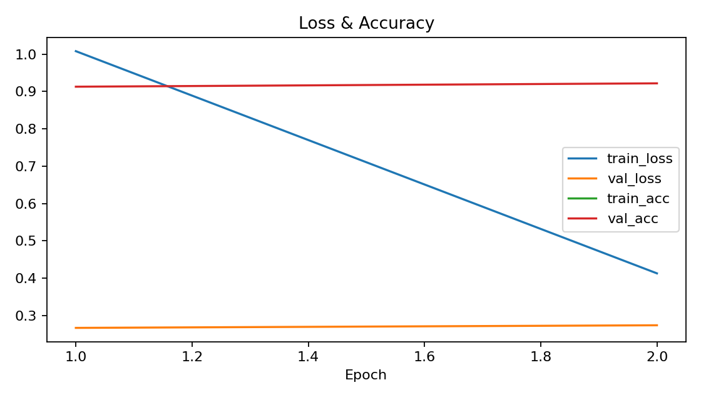

# 📰 AG News Topic Classification  
### Ujian Akhir Praktikum – Pembelajaran Mesin

---

## 📌 Deskripsi Proyek
Proyek ini merupakan **Ujian Akhir Praktikum (UAP) Mata Kuliah Pembelajaran Mesin** yang berfokus pada pembangunan, evaluasi, dan implementasi **sistem klasifikasi teks berita** menggunakan dataset **AG News**.

Pada proyek ini dilakukan **perbandingan performa tiga model pembelajaran mesin**, yaitu:
1. **Neural Network berbasis LSTM (Non-Pretrained)**
2. **DistilBERT (Pretrained Transformer)**
3. **BERT (Pretrained Transformer)**

Selain evaluasi kuantitatif, seluruh model diintegrasikan ke dalam **aplikasi web berbasis Streamlit** untuk keperluan demonstrasi dan analisis hasil prediksi.

---

## 📂 Dataset
Dataset yang digunakan adalah **AG News Dataset**, yang terdiri dari berita berbahasa Inggris dan terbagi ke dalam **4 kelas utama**:
- **World**
- **Sports**
- **Business**
- **Sci/Tech**

link dataset : [INI ADALAH LINK DATASETNYA TINGGAL KLIK AJA](https://www.kaggle.com/datasets/amananandrai/ag-news-classification-dataset?resource=download)

Setiap data merupakan gabungan dari **judul dan deskripsi berita**, sehingga cocok untuk tugas klasifikasi teks berbasis konteks.

### 🔄 Tahapan Preprocessing
- Case folding (lowercase)
- Penghapusan karakter non-alfanumerik
- Tokenisasi teks
- Padding & truncation (untuk model neural network)
- Encoding label kelas

---

## 🧠 Model yang Digunakan

### 1️⃣ LSTM (Non-Pretrained)
- Model neural network yang dilatih dari nol
- Menggunakan embedding sederhana dan arsitektur LSTM
- Digunakan sebagai **baseline model**

### 2️⃣ DistilBERT (Pretrained)
- Model transformer hasil distilasi dari BERT
- Lebih ringan dan cepat
- Menghasilkan peningkatan performa signifikan dibanding LSTM

### 3️⃣ BERT (Pretrained)
- Model transformer penuh
- Mampu menangkap konteks semantik lebih kompleks
- Memberikan performa terbaik dalam eksperimen ini

---

## 📊 Evaluasi Model

Evaluasi dilakukan menggunakan **data uji (test set)** dengan metrik berikut:
- Accuracy
- Precision
- Recall
- F1-score
- Confusion Matrix
- Grafik Loss & Accuracy

### 🔍 Ringkasan Performa Model

| Nama Model | Akurasi | Hasil Analisis |
|-----------|--------|----------------|
| **LSTM (Non-Pretrained)** | **0.7984** | Performa cukup baik sebagai baseline, namun masih sering tertukar pada kelas Business dan World karena keterbatasan pemahaman konteks. |
| **DistilBERT (Pretrained)** | **0.9109** | Performa meningkat signifikan. Kesalahan klasifikasi berkurang dan model lebih stabil dalam memahami konteks berita. |
| **BERT (Pretrained)** | **0.9233** | Memberikan hasil terbaik dengan akurasi tertinggi dan distribusi prediksi paling seimbang di seluruh kelas. |

---

## 🧩 Confusion Matrix
Confusion Matrix digunakan untuk menganalisis kesalahan klasifikasi antar kelas.

- **LSTM**: masih sering tertukar antara *Business* dan *Sci/Tech*
- **DistilBERT**: kesalahan jauh berkurang
- **BERT**: prediksi paling konsisten dan akurat
## 🧩 Confusion Matrix

### LSTM


### DistilBERT


### BERT


---

## 📈 Kurva Training (Loss & Accuracy)
Grafik training menunjukkan bahwa:
- LSTM membutuhkan epoch lebih banyak dan cenderung overfitting
- DistilBERT dan BERT konvergen lebih cepat
- Model pretrained lebih stabil selama proses training
## 📈 Loss & Accuracy Curves

### LSTM


### DistilBERT


### BERT


---

## 🌐 Implementasi Website (Streamlit)
Sistem website sederhana dibangun menggunakan **Streamlit** dengan fitur:
- Input teks berita (judul + deskripsi)
- Pemilihan model (LSTM / DistilBERT / BERT)
- Output prediksi kelas beserta probabilitas
- Tampilan metrik evaluasi, confusion matrix, dan grafik training

### 🔗 Live Demo
👉 **Streamlit App**  
Coming Soon, udah jadi kok

---

## ▶️ Cara Menjalankan Secara Lokal

```bash
# Clone repository
git clone https://github.com/<username>/<repo-name>.git
cd <repo-name>

# Install dependency
pip install -r requirements.txt

# Jalankan aplikasi
streamlit run src/app.py

## 📁 Struktur Repository
UAP/
├── src/
│   ├── app.py
│   ├── train_lstm.py
│   ├── train_transformer.py
│   └── data_utils.py
├── data/
│   └── raw/
├── models/
│   ├── lstm/
│   ├── distilbert/
│   └── bert/
├── reports/
│   ├── metrics/
│   └── figures/
├── requirements.txt
└── README.md


📌 Kesimpulan

Berdasarkan hasil eksperimen:

Model pretrained (DistilBERT & BERT) secara konsisten mengungguli model non-pretrained

BERT memberikan performa terbaik dengan akurasi tertinggi

Implementasi Streamlit mempermudah proses evaluasi dan demonstrasi model secara interaktif

Proyek ini menunjukkan bahwa pemanfaatan pretrained transformer sangat efektif untuk tugas klasifikasi teks dibandingkan model neural network konvensional.

👤 Identitas

Nama: Andika Nur Islamy
NIM: 202210370311063
Program Studi: Informatika
Universitas: Universitas Muhammadiyah Malang